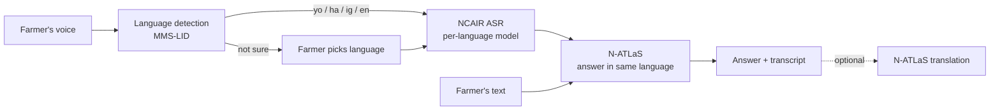

# AgriVoice

**A voice-first farming assistant for Nigerian smallholder farmers, built on NCAIR's N-ATLaS.**

A farmer asks a question by voice or text in **Yoruba, Hausa, Igbo or Nigerian English**. AgriVoice detects the language, transcribes it with NCAIR's speech models, and answers in the same language with **N-ATLaS**, Nigeria's multilingual language model. Answers can be translated into any of the other three languages.

- **Live API:** <https://132-145-21-82.sslip.io/docs> (interactive)
- **Frontend guide:** [docs/api.md](docs/api.md)
- **Architecture:** [docs/architecture.md](docs/architecture.md) · **Deployment:** [docs/deployment.md](docs/deployment.md)

---

## How N-ATLaS and the NCAIR models are used

| Step | Model | Role |
|---|---|---|
| Transcribe speech | [NCAIR1/Yoruba-ASR](https://huggingface.co/NCAIR1/Yoruba-ASR), [Hausa-ASR](https://huggingface.co/NCAIR1/Hausa-ASR), [Igbo-ASR](https://huggingface.co/NCAIR1/Igbo-ASR), [NigerianAccentedEnglish](https://huggingface.co/NCAIR1/NigerianAccentedEnglish) | The model for the detected (or chosen) language turns the recording into text |
| Answer | [**NCAIR1/N-ATLaS**](https://huggingface.co/NCAIR1/N-ATLaS) | Writes the agricultural advice, in the farmer's language, with conversation history |
| Translate | **NCAIR1/N-ATLaS** | Translates any answer between the four languages |
| Detect the spoken language | [facebook/mms-lid-126](https://huggingface.co/facebook/mms-lid-126) *(supporting)* | Picks which NCAIR speech model to use. NCAIR's speech models are each fine-tuned for one language and can't identify languages, so a dedicated detector is used. If it isn't confident, the farmer chooses the language |

N-ATLaS is used exactly as its model card specifies: official weights, the chat template with `date_string`, `repetition_penalty=1.12`, greedy decoding.



## Features

- **Voice or text** questions; browser recordings (WebM, MP4/AAC, WAV, MP3, OGG) accepted as-is
- **Automatic language detection**, with a language picker when detection isn't confident
- **Answers in the farmer's language**, kept short for listening on a phone
- **Translation** of answers between Yoruba, Hausa, Igbo and English (via English between two Nigerian languages, which measurably improved quality)
- **Conversations and feedback** (👍/👎) stored for evaluation
- **Admin dashboard** (`/admin`): every question and answer with timings and errors, server and model status, live settings, and **start / stop / scheduling of N-ATLaS** on its GPU

## Results so far

Preliminary measurements on small samples; native-speaker evaluation is in progress.

| Check | Result |
|---|---|
| Language detection on native speech ([FLEURS](https://huggingface.co/datasets/google/fleurs) Yoruba, Hausa, Igbo + English) | 14 / 14 correct, ≥ 93 % confidence |
| NCAIR transcription of FLEURS clips | Close to the reference text in all three Nigerian languages |
| N-ATLaS answers in the question's language | 4 / 4 languages |
| Translation Hausa → English | Faithful, formatting and product names kept |
| Translation Hausa → Yoruba | Direct translation mixed in Hausa words; translating via English removed them |
| End-to-end voice question (production) | ~30–36 s: detection + transcription on CPU 13–27 s, N-ATLaS on GPU 16–32 s |

## Repository

```
backend/        FastAPI service: pipeline, model adapters, admin dashboard, tests
natlas-space/   N-ATLaS serving app (Gradio) for a Kaggle GPU or Hugging Face Space
docs/           API guide, architecture, deployment
```

## Run it

```bash
cd backend
cp .env.example .env
uv sync
DEV_USE_MOCK_MODELS=true uv run uvicorn app.main:app --reload   # no models needed
DEV_USE_MOCK_MODELS=true uv run pytest                          # tests
```

Details, including running with the real models, are in [backend/README.md](backend/README.md).

## Licences and acknowledgements

- **N-ATLaS** and the **NCAIR ASR models** are by the [National Centre for Artificial Intelligence and Robotics (NCAIR)](https://huggingface.co/NCAIR1) and [Awarri](https://awarri.com), released under NCAIR's terms. They are gated: users accept the licence on Hugging Face.
- **MMS-LID** is by Meta AI under [CC BY-NC 4.0](https://creativecommons.org/licenses/by-nc/4.0/) (non-commercial).
- **FLEURS** (Google) was used for evaluation only.
