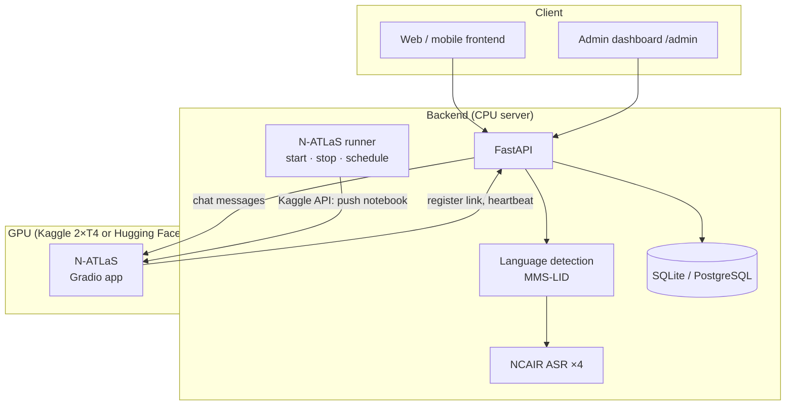

# Architecture

AgriVoice is an orchestration layer around NCAIR's models: it doesn't train or modify them. It runs as two parts, because N-ATLaS needs a GPU and the rest doesn't.

| Part | Where | Why there |
|---|---|---|
| Backend: API, language detection, 4 NCAIR ASR models, database, admin | Always-on CPU server (Oracle Cloud, 2 cores, 12 GB) | The speech models are small enough for CPU (~8 GB together) |
| N-ATLaS | GPU: a Kaggle notebook (2× T4) or a Hugging Face ZeroGPU Space | ~16 GB of weights; answers in 15–30 s on GPU versus minutes on CPU |

The backend calls N-ATLaS through `gradio_client`. Its address can change (each Kaggle session gets a new public link), so it is held in a **registry** the notebook updates itself; requests always use the current one.

## Request flow: a voice question

1. **Upload checks**: type (codecs such as `audio/webm;codecs=opus` accepted), size.
2. **Convert** to 16 kHz mono WAV with `ffmpeg`.
3. **Language**: the farmer's choice if given; otherwise MMS-LID on the first 8 s. Below the confidence threshold (default 0.6), the API answers `LANGUAGE_NOT_DETECTED` with the language list and the client resends with the farmer's choice.
4. **Transcribe** with that language's NCAIR model. Yoruba, Hausa and English force Whisper's language token; Igbo has none in Whisper, so it decodes unforced, as its model card does.
5. **Answer** with N-ATLaS: system prompt (agricultural advisor, same language, short answers), conversation history, then the question.
6. **Store** the conversation, messages and an interaction log (prompt, response, per-step timings, errors).

If N-ATLaS is offline, steps 1–4 still run: the farmer gets the transcript and a "temporarily unavailable" notice instead of an error.

## Code structure (`backend/app`)

| Layer | Contents |
|---|---|
| `api/routes` | Endpoints. `voice`, `chat`, `translate`, `conversations`, `feedback`, `languages`, `health`; `admin` (dashboard API + page); `natlas` (callbacks from the GPU notebook) |
| `services` | `voice_pipeline` (the flow above), `llm_service` + `prompt_service` (prompts, translation), `language_detection`, `language_router`, `model_manager` (loads models, picks local/remote/mock N-ATLaS), `llm_endpoint` (registry), `natlas_runner` (Kaggle control), `runtime_settings` |
| `models` | Adapters behind small interfaces (`base.py`): NCAIR ASR, N-ATLaS local and remote, MMS language detector |
| `repositories`, `db` | SQLAlchemy models and data access |

Every model sits behind an interface with a mock implementation, so the whole API runs and is tested without downloads or a GPU (`DEV_USE_MOCK_MODELS=true`).

## Design decisions

**Language detection with MMS-LID.** We first tried Whisper's built-in language identification on the NCAIR models. Tested on native recordings, each fine-tuned model labelled *every* clip as its own language (the Yoruba model called Hausa and Igbo audio "Yoruba" at ~100 % confidence), and Whisper has no Igbo token at all. MMS-LID identified all 14 test clips correctly, so it is used only to choose which NCAIR model transcribes.

**Translation via English.** Direct Hausa → Yoruba translation by N-ATLaS mixed Hausa words into the Yoruba output; Hausa → English and English → Yoruba were each clean. Translations between two Nigerian languages therefore go through English, and the English step is saved and reused.

**Short answers.** At a 350-token limit, N-ATLaS answers were sometimes cut off mid-sentence. The prompt now asks for about 150 words or five points, which completes within the limit and is faster to listen to.

**Faster language detection.** On the 2-core server, MMS-LID on 30 s of audio took ~30 s. Accuracy held on the first 8 s (5 s misread Hausa), halving response time.

## N-ATLaS control (Kaggle)

Kaggle's API can start a notebook but not stop one. So when the dashboard starts N-ATLaS, the backend pushes the notebook with a **one-time run key**; the notebook:

1. loads N-ATLaS on both GPUs and opens a public Gradio link,
2. registers that link with the backend using the run key,
3. sends a heartbeat every minute; the reply says `continue` or `stop`,
4. shuts down when told to stop or when its time is up, and reports `stopped`.

The backend reconciles with Kaggle's reported status (sessions can also end on their own), counts GPU hours against a weekly limit, and runs an optional schedule (days, times, date range, time zone). Runs started by hand on kaggle.com register with the admin token instead.

## Data

| Table | Holds |
|---|---|
| `conversations`, `messages` | Dialogue history (voice transcripts and answers) |
| `message_translations` | Saved translations, one per message and language |
| `feedback` | 👍/👎 ratings on answers |
| `interaction_logs` | Every request, including failures: prompt, response, language and how it was chosen, models, per-step timings, error type |
| `app_settings` | Dashboard state: settings overrides, N-ATLaS endpoint, runner state and history, schedule |

SQLite creates and extends its tables on startup; PostgreSQL uses the Alembic migrations in `backend/alembic`.

## Security

- `/admin` and its API require `ADMIN_TOKEN` (bearer); they return 404 when it isn't set.
- Notebook callbacks accept only the current run's key (stored hashed); a stale key is told to stop.
- The dashboard inserts all user content as text, never HTML.
- Mock models are refused when `ENVIRONMENT=production`.
- Secrets live in `.env` on the server and in Kaggle (Secrets or a private dataset), never in the repository.

## Known limitations

- N-ATLaS is available only while its GPU session runs (Kaggle: 30 free GPU hours a week).
- On the 2-core server, detection and transcription take 13–27 s per question, and requests are handled one at a time.
- Translation quality between Nigerian languages needs native-speaker review.
- MMS-LID is licensed for non-commercial use only.
